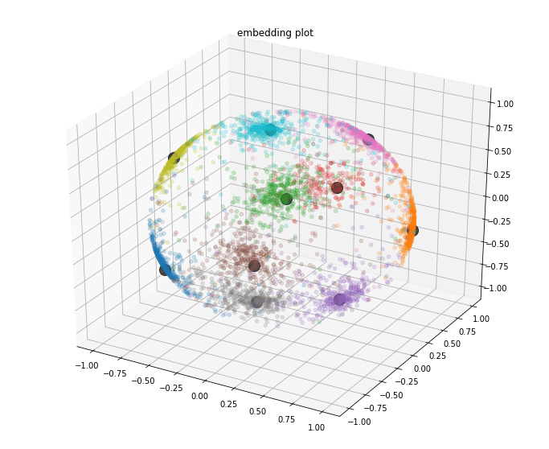
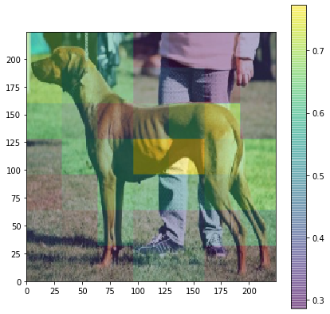
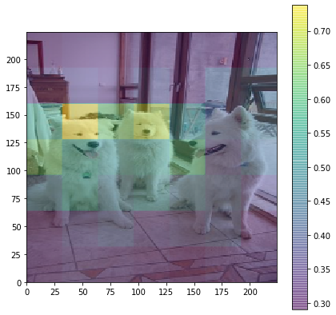
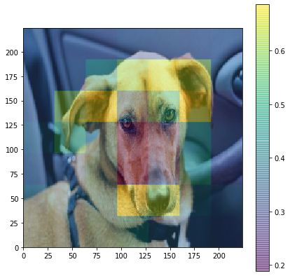

## Implementation of [Unifying Deep Local and Global Features for Image Search](https://arxiv.org/abs/2001.05027)

From paper above it's important to train model in two steps - training global features & training local features.

Global features produce embedding like this:

    

(Big black points - class centroids)

For training local features used attention, here are few examples of attention maps:

    
    
    

